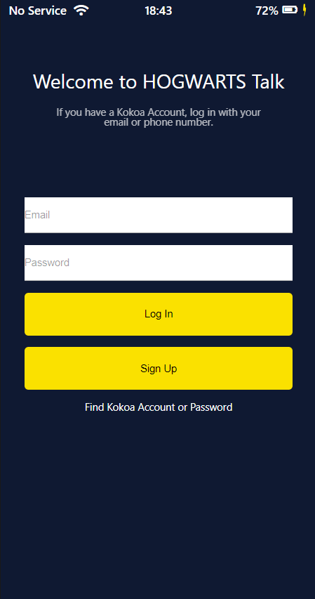
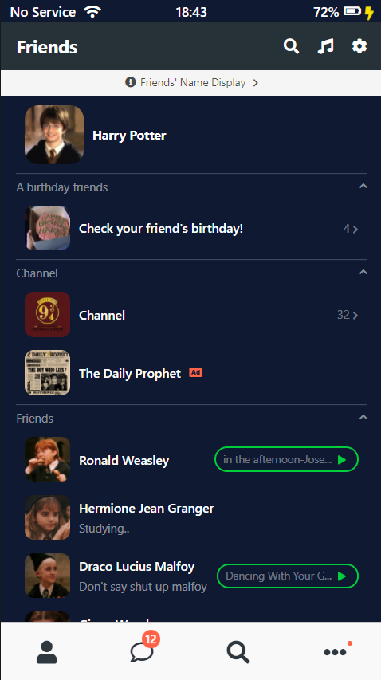
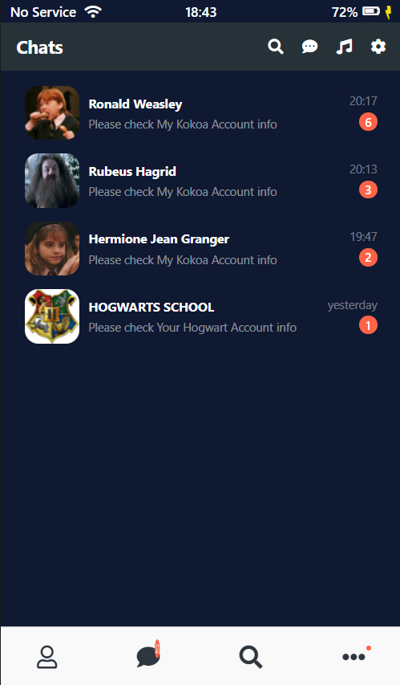
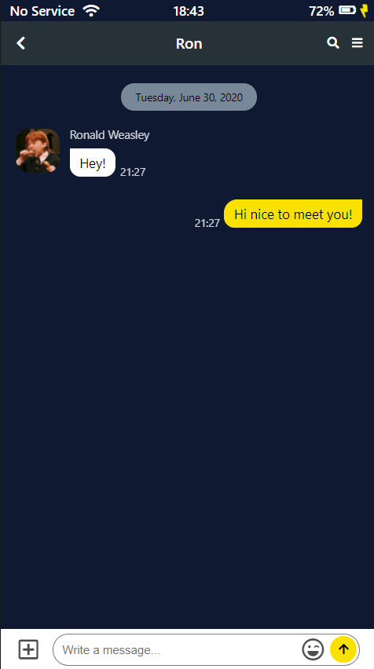
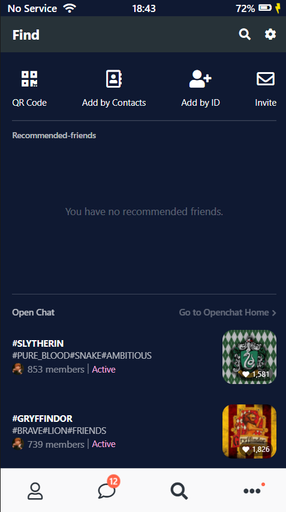
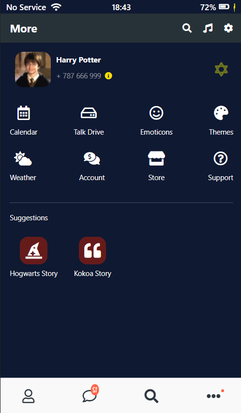
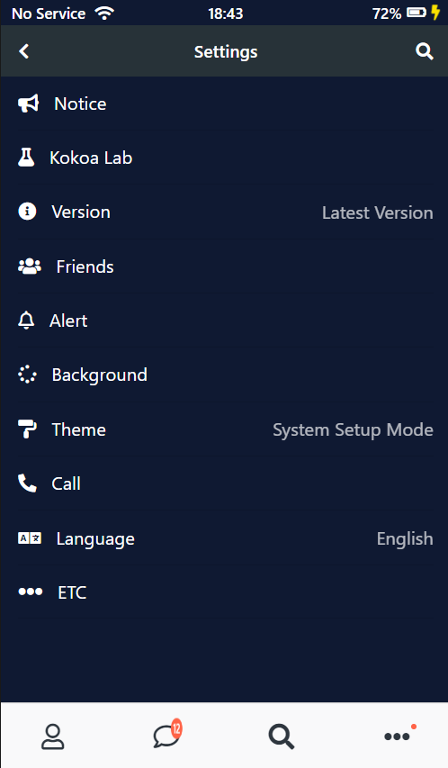

# Hogwarts Talk 2021

HTML & CSS 로 만든 Messager Screen 입니다.

### Preview

💡 [SITE](https://chaeikim-tech.github.io/kokoa-clone-2021/)

### Pages

- [x] Login
- [x] Friends
- [x] Chats
- [x] Chatting
- [x] Find
- [x] More
- [x] Setting

### Skills

### Features

* CSS의 keyframes 애니메이션으로 Friends 메뉴로 이동할 때 Splash animation을 생성.
* @media screen 속성을 이용하여 screen이 mobile 사이즈가 아닐 경우 화면이 보이지 않게 적용.
